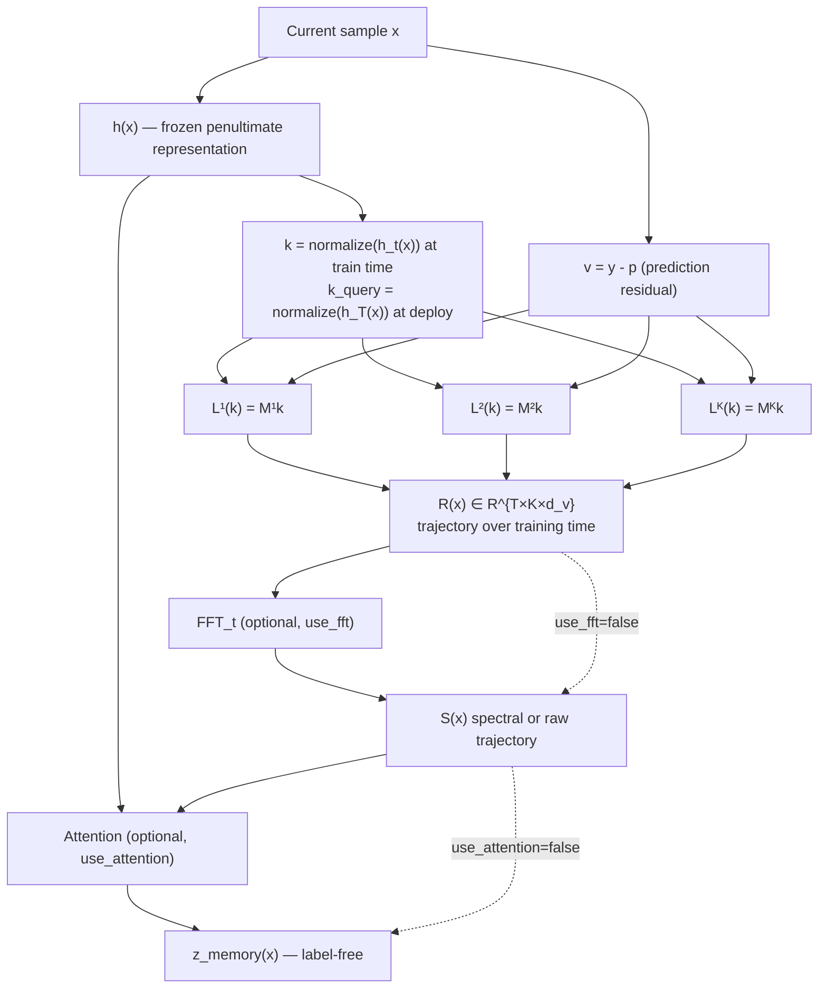

# NRO-NRMv2 — Nested Learning-Experience Memory

## Overview

This document specifies the memory pipeline sequentially, from the current sample representation through multi-level associative memory, temporal trajectory construction, optional FFT-based spectral representation, and optional attention-based retrieval.

The intended deployment-time output is a **label-free memory representation**:

\[
z_{\text{memory}}(x)
\]

The memory itself is separated from the classifier's prediction mechanism.

---

## 1. Overall Memory Pipeline

---

# 2. Sample Representation

Let the classifier produce a penultimate representation:

\[
h_t(x) \in \mathbb{R}^{d_k}
\]

for sample \(x\) at training time \(t\).

The representation used as the associative-memory key is normalized:

\[
\boxed{
k_t(x)
=
\frac{h_t(x)}
{\|h_t(x)\|_2+\epsilon}
}
\]

At deployment, the classifier is frozen and the final representation is used:

\[
\boxed{
k_{\text{query}}(x)
=
\frac{h_T(x)}
{\|h_T(x)\|_2+\epsilon}
}
\]

where \(T\) denotes the end of classifier training.

### Important distinction

Training-time memory keys are based on:

\[
h_t(x)
\]

whereas deployment queries use:

\[
h_T(x).
\]

Thus the key space may move during training.

---

# 3. Learning-Experience Value

For a classification sample with target \(y\) and predicted probability vector \(p\),

\[
p_t(x)
=
\operatorname{softmax}(f_{\theta_t}(x)).
\]

The local learning/surprise signal is represented by the prediction residual:

\[
\boxed{
v_t(x)=y-p_t(x)
}
\]

where \(y\) is the one-hot target vector.

For cross-entropy classification, this corresponds to the negative gradient with respect to the model output/logit representation, up to the chosen sign convention:

\[
v_t(x)
=
-\nabla_{u_t}\ell.
\]

The memory therefore attempts to associate an experienced representation \(k_t\) with its local prediction residual \(v_t\).

---

# 4. Associative Memory

Each memory level is an explicit associative mapping:

\[
L^{(j)}:\mathbb{R}^{d_k}\rightarrow\mathbb{R}^{d_v}.
\]

For the initial linear implementation,

\[
\boxed{
L^{(j)}(k)=M^{(j)}k
}
\]

where

\[
M^{(j)}\in\mathbb{R}^{d_v\times d_k}.
\]

Thus, for an experienced sample,

\[
k_t
\longrightarrow
M^{(j)}k_t
\approx
v_t.
\]

Each level is a separate memory rather than an EMA of another memory level.

---

# 5. Associative-Memory Objective

For a memory level \(j\), define the online L2 associative-memory objective:

\[
\boxed{
\mathcal{L}_{\text{mem}}^{(j)}
=
\frac{1}{2}
\left\|
M^{(j)}k_t-v_t
\right\|_2^2
}
\]

The memory is therefore trained to predict the learning-experience value associated with the current key.

The prediction error of the memory is:

\[
e_t^{(j)}
=
M^{(j)}k_t-v_t.
\]

---

# 6. Delta-Rule Memory Update

The gradient of the memory objective with respect to \(M^{(j)}\) is:

\[
\nabla_{M^{(j)}}\mathcal{L}_{\text{mem}}^{(j)}
=
\left(M^{(j)}k_t-v_t\right)k_t^\top.
\]

Using online gradient descent with memory learning rate \(\eta_j\):

\[
\boxed{
M_{t+1}^{(j)}
=
M_t^{(j)}
-
\eta_j
\left(
M_t^{(j)}k_t-v_t
\right)
k_t^\top
}
\]

or equivalently:

\[
\boxed{
M_{t+1}^{(j)}
=
M_t^{(j)}
+
\eta_j
\left(
v_t-M_t^{(j)}k_t
\right)
k_t^\top
}
\]

This is the basic delta-rule form.

---

# 7. Optional Retention Term

If retention is used, the memory objective can include:

\[
\boxed{
\mathcal{L}_{\text{mem}}^{(j)}
=
\frac12
\left\|
M^{(j)}k_t-v_t
\right\|_2^2
+
\frac{\lambda_{\text{ret},j}}{2}
\left\|
M^{(j)}-M_t^{(j)}
\right\|_F^2
}
\]

The retention term penalizes large changes to the previous memory state.

This term should be treated as an explicit memory-design choice rather than silently assumed.

---

# 8. Multi-Timescale Memory Levels

The memory consists of \(K\) independent levels:

\[
\boxed{
\left\{
L^{(1)},L^{(2)},\ldots,L^{(K)}
\right\}
}
\]

with

\[
L^{(j)}(k)=M^{(j)}k.
\]

Each level receives the same learning-experience stream:

\[
(k_t,v_t),
\]

but operates with its own temporal/update scale.

Conceptually:

\[
L^{(1)}
\rightarrow
\text{fast context}
\]

\[
L^{(2)}
\rightarrow
\text{intermediate context}
\]

\[
\vdots
\]

\[
L^{(K)}
\rightarrow
\text{slow context}.
\]

The levels are **not** defined as:

\[
L^{(2)}=\operatorname{EMA}(L^{(1)})
\]

or

\[
L^{(3)}=\operatorname{EMA}(L^{(2)}).
\]

Instead, every level is its own associative learner.

---

# 9. Memory-Level Query

For a query sample \(x\), each memory level produces:

\[
\boxed{
r_t^{(j)}(x)
=
L_t^{(j)}
\left(
k_{\text{query}}(x)
\right)
}
\]

with

\[
r_t^{(j)}(x)\in\mathbb{R}^{d_v}.
\]

At each recorded training-time checkpoint \(t\), all memory levels can therefore be queried using the same deployment representation.

---

# 10. Learning Trajectory

Let \(t_1,\ldots,t_T\) denote the recorded training-time checkpoints.

For sample \(x\), collect the memory responses:

\[
\boxed{
R(x)
\in
\mathbb{R}^{T\times K\times d_v}
}
\]

where

\[
\boxed{
R[t,j,:]
=
L_{t}^{(j)}
\left(
k_{\text{query}}(x)
\right)
}
\]

Thus \(R(x)\) represents how the different memory levels respond to the sample across training time.

The temporal axis has semantic meaning:

\[
t_1<t_2<\cdots<t_T.
\]

---

# 11. Raw Trajectory Representation

When FFT is disabled:

\[
\boxed{
S(x)=R(x)
}
\]

This provides the non-spectral baseline.

It is important to retain this path because it allows the experiment to distinguish:

\[
\text{raw memory trajectory}
\]

from

\[
\text{FFT-derived memory representation}.
\]

---

# 12. Temporal FFT

When `use_fft=true`, apply FFT along the training-time axis only:

\[
\boxed{
\widehat{R}(x)
=
\operatorname{FFT}_{t}
\left[
R(x)
\right]
}
\]

For every memory level and value dimension:

\[
\widehat{R}[f,j,:]
=
\operatorname{FFT}_t
\left(
R[:,j,:]
\right).
\]

The frequency index \(f\) therefore represents temporal frequency in the memory trajectory.

The FFT is a representation transform:

\[
R
\rightarrow
\widehat R.
\]

It does not by itself imply amplification or improved information content.

---

# 13. Spectral Memory Representation

The spectral representation can be derived from the FFT output.

A simple magnitude representation is:

\[
\boxed{
S(x)
=
\left|
\widehat{R}(x)
\right|
}
\]

where the absolute value is taken elementwise.

More generally:

\[
\boxed{
S(x)
=
\Psi
\left(
\operatorname{FFT}_{t}(R(x))
\right)
}
\]

where \(\Psi\) is the selected spectral feature transformation.

Possible choices include:

- complex FFT coefficients;
- magnitude;
- selected frequency bands;
- low-frequency components;
- high-frequency components;
- learned spectral weighting.

The particular choice must be documented for each experiment.

---

# 14. Optional Spectral Weighting / Amplification

If spectral amplification is introduced, define a frequency-dependent weighting function:

\[
A(f).
\]

Then:

\[
\boxed{
\widehat{R}'(f,j,:)
=
A(f)\odot
\widehat{R}(f,j,:)
}
\]

followed by the selected inverse or feature extraction operation.

Important:

\[
\operatorname{FFT} \neq \text{amplification}.
\]

Amplification occurs only when a weighting/filtering operation changes the relative magnitude of frequency components.

---

# 15. Attention-Based Retrieval

When `use_attention=true`, the final representation \(h_T(x)\) provides the query:

\[
\boxed{
q(x)=W_q h_T(x)
}
\]

The spectral/raw memory representation supplies memory keys and values:

\[
K_{\text{mem}}
=
W_k S(x)
\]

\[
V_{\text{mem}}
=
W_v S(x).
\]

Attention weights are:

\[
\boxed{
\operatorname{AttnWeights}
=
\operatorname{softmax}
\left(
\frac{
qK_{\text{mem}}^\top
}{
\sqrt{d_k}
}
\right)
}
\]

and the retrieved memory representation is:

\[
\boxed{
z_{\text{memory}}(x)
=
\operatorname{AttnWeights}
V_{\text{mem}}
}
\]

For multi-head attention, the corresponding head outputs are concatenated and projected according to the implementation.

---

# 16. Attention-Free Path

When `use_attention=false`, the memory representation is used directly:

\[
\boxed{
z_{\text{memory}}(x)=S(x)
}
\]

or through the explicitly configured deterministic projection/aggregation.

This path is required for isolating the effect of attention.

---

# 17. Label-Free Deployment

At deployment, the memory representation must not depend on the test label.

The allowed information is:

\[
x
\rightarrow
h_T(x)
\rightarrow
k_{\text{query}}(x)
\rightarrow
\text{frozen memory}
\rightarrow
S(x)
\rightarrow
z_{\text{memory}}(x).
\]

The forbidden deployment dependency is:

\[
y_{\text{test}}
\rightarrow
v_{\text{test}}
\rightarrow
z_{\text{memory}}.
\]

Therefore:

\[
\boxed{
z_{\text{memory}}(x)
\text{ is label-free}
}
\]

during evaluation.

---

# 18. Frozen Memory at Deployment

After classifier training and memory construction:

\[
M_T^{(j)}
\]

and all trajectory-derived representations are frozen.

No validation or test sample updates the memory during the primary evaluation.

The deployment pipeline is therefore:

\[
\boxed{
\text{training data}
\rightarrow
\text{memory learning}
\rightarrow
\text{freeze}
\rightarrow
\text{validation/test queries}
}
\]

rather than online adaptation on evaluation samples.

---

# 19. Relation to the Original Nested-EMA Memory

The previous memory mechanism was based on repeated temporal smoothing:

\[
g_t
\rightarrow
G_t
\rightarrow
B_t
\rightarrow
A_t
\rightarrow
L_t^{(1)}
\rightarrow
L_t^{(2)}
\rightarrow\cdots
\]

with EMA updates such as:

\[
L_t
=
(1-\lambda)L_{t-1}
+
\lambda X_t.
\]

The current associative formulation instead uses:

\[
\boxed{
(k_t,v_t)
\rightarrow
M_t^{(j)}
\rightarrow
L_t^{(j)}(k)
}
\]

so that the memory explicitly attempts to learn a mapping from experienced representations to learning/surprise signals.

This is the conceptual distinction between:

- **temporal gradient smoothing**, and
- **associative learning-experience memory**.

---

# 20. Research Interpretation

The intended hypothesis is:

\[
\boxed{
\text{training history contains sample-specific information}
}
\]

that may not be fully represented by the final representation \(h_T(x)\).

The memory mechanism tests this through:

\[
h_T(x)
\rightarrow
z_{\text{memory}}(x).
\]

The decisive downstream comparison is therefore:

\[
\boxed{
H+h
\quad\text{vs}\quad
H+h+z_{\text{memory}}
}
\]

rather than simply comparing:

\[
H
\quad\text{vs}\quad
H+z_{\text{memory}}.
\]

An improvement of the latter does not establish that memory adds information beyond the current representation.

---

# 21. Required Memory Diagnostics

Before interpreting downstream failure-detection or deferral results, evaluate whether the memory actually learns its intended mapping.

For each memory level \(j\), compare:

\[
\hat v_t^{(j)}
=
M_t^{(j)}k_t
\]

against:

\[
v_t.
\]

Recommended diagnostics:

### Mean squared error

\[
\boxed{
\operatorname{MSE}^{(j)}
=
\frac1N
\sum_i
\left\|
\hat v_i^{(j)}-v_i
\right\|_2^2
}
\]

### Cosine similarity

\[
\boxed{
\operatorname{Cos}^{(j)}
=
\frac{
\hat v_i^{(j)}\cdot v_i
}{
\|\hat v_i^{(j)}\|_2
\|v_i\|_2+\epsilon
}
}
\]

These diagnostics determine whether the underlying memory representation is functioning before its downstream utility is assessed.

---

# 22. Required Ablation Structure

The implementation should support the following conceptual comparisons:

### Entropy only

\[
H
\]

### Current representation

\[
H+h
\]

### Raw memory trajectory

\[
H+h+z_{\text{raw}}
\]

### FFT memory

\[
H+h+z_{\text{FFT}}
\]

### FFT + attention

\[
H+h+z_{\text{memory}}
\]

### Random-memory control

\[
H+h+z_{\text{random}}
\]

These comparisons isolate:

1. the current representation;
2. the memory trajectory;
3. FFT;
4. attention;
5. learned memory versus random memory.

---

# 23. Scientific Interpretation Rules

The following claims must not be made without corresponding evidence.

### Do not claim:

> FFT improves memory.

unless raw trajectory and FFT representations have been directly compared.

### Do not claim:

> Attention extracts useful historical information.

unless attention is compared against an appropriate non-attention aggregation.

### Do not claim:

> The memory contains useful learning experience.

unless memory diagnostics demonstrate that it captures a meaningful learning-related signal.

### Do not claim:

> Memory improves failure detection.

unless:

\[
H+h+z_{\text{memory}}
\]

reliably improves over:

\[
H+h
\]

with an appropriate statistical test.

---

# 24. Compact End-to-End Equation

The complete mechanism can be summarized as:

\[
\boxed{
x
\rightarrow
h_t(x)
\rightarrow
k_t
\rightarrow
\left\{
M_t^{(j)}k_t
\right\}_{j=1}^{K}
\rightarrow
R(x)
\rightarrow
\operatorname{FFT}_t
\rightarrow
S(x)
\rightarrow
\operatorname{Attention}
\rightarrow
z_{\text{memory}}(x)
}
\]

with the training-time associative update:

\[
\boxed{
M_{t+1}^{(j)}
=
M_t^{(j)}
+
\eta_j
\left(
v_t-M_t^{(j)}k_t
\right)
k_t^\top
}
\]

and:

\[
\boxed{
k_t=
\frac{h_t(x_t)}
{\|h_t(x_t)\|_2+\epsilon},
\qquad
v_t=y_t-p_t.
}
\]

At deployment:

\[
\boxed{
k_{\text{query}}=
\frac{h_T(x)}
{\|h_T(x)\|_2+\epsilon}
}
\]

and no test label is required.
