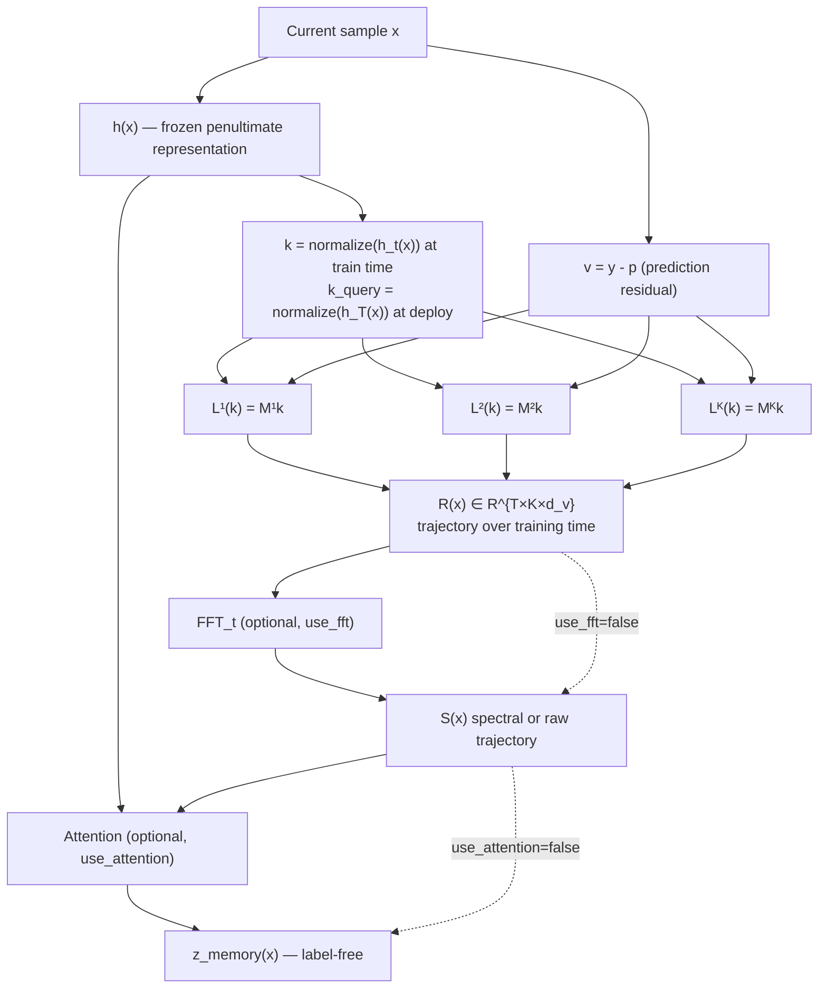

# Cursor Implementation Plan — Associative Learning-Trajectory Memory + FFT + Attention

## Strategy: copy first, then patch memory only

**Working repository:** `optimization-history-failure-detection`

**Source of truth (read-only baseline):** `optimization-algorithm`

```
Step 1:  COPY  required files verbatim from optimization-algorithm
Step 2:  DEBUG copied baseline until imports/tests/smoke-run pass
Step 3:  PATCH only memory-related code paths
Step 4:  RE-RUN via two canonical validation notebooks (no other notebook entry points)
```

Do **not** create parallel copies of experiment drivers (`nro_final_experiment.py`, `clinical_failure.py`, `msa_linear_deferral.py`, etc.). Those Python modules are copied once and called from the two notebooks.

Do **not** add files unrelated to the memory replacement unless required to make the copied baseline runnable (e.g. `pyproject.toml`, `requirements.txt`).

### Canonical validation notebooks (only two)

Users validate all claims by running **exactly these two notebooks** — no other notebook is required or maintained:

| Notebook | Purpose | Datasets |
|----------|---------|----------|
| `notebooks/dermamnist_full_validation.ipynb` | **Primary** — full end-to-end pipeline on DermaMNIST | DermaMNIST (+ DermaMNIST-E external for deferral) |
| `notebooks/retinamnist_organcmnist_deferral.ipynb` | **Secondary** — deferral generalization only | RetinaMNIST, OrganAMNIST |

The three copied notebooks (`final_clinical_failure.ipynb`, `final_nro_conditional_information.ipynb`, `final_msa_linear_deferral.ipynb`) are **retired** after the two canonical notebooks land. They may remain in the repo as archived reference but must not be linked from README or docs.

---

## Objective

Replace **only** the memory implementation while keeping the entire NRO research pipeline frozen.

The decisive comparison:

\[
\text{H} + h \quad\text{vs}\quad \text{H} + h + z_{\text{memory}}
\]

Do **not** assume the new mechanism will improve results.

### Conceptual pipeline



---

## Phase 0 — Copy baseline from optimization-algorithm

**Do not modify any copied file in this phase.** Direct copy-paste only.

### 0.1 Copy manifest (required)

Copy these paths from `optimization-algorithm` → `optimization-history-failure-detection` preserving directory structure:

| Path | Why needed |
|------|------------|
| `optimizer/` | NRM v2 observe (`nrm_v2`), nested EMA memory (to be replaced), timescales |
| `research/common/` | Training, scoring, deferral, error prediction, ResNet, MSA |
| `research/phase0_baseline/` | `batch_iterator` dependency |
| `research/incremental_memory_deferral/` | H+h+z deferral experiment (reuse, patch memory load only) |
| `research/memory_identification/` | Failure detection + random-memory controls |
| `research/clinical_failure` deps via `research/common/clinical_failure.py` | Main training + scoring pipeline |
| `tests/` | Existing tests + baseline regression |
| `pyproject.toml` / `requirements.txt` / `setup.cfg` (if present) | Runnable environment |

**Notebooks — do not copy the old trio.** Instead, create the two canonical notebooks listed above. The old notebooks in `optimization-algorithm/notebooks/` are reference-only during authoring.

### 0.2 Copy manifest (optional — reference only, not required to copy)

| Path | Treatment |
|------|-----------|
| `research/final_experiment/` checkpoints/artifacts | **Do not copy** large artifacts by default; point `source_experiment_dir` at source repo or copy only if retraining locally |
| `research/dermamnist_nro_final/` | **Reference** old H+N baseline results from source repo for comparison |
| `research/document/`, `research/figures/`, `research/paper_*` | **Do not copy** — unrelated to memory |
| `research/baseline_comparison/` | **Do not copy** unless needed for a specific ablation |
| `.git/` | **Do not copy** |

### 0.3 Copy rules

1. **Verbatim copy** — no edits during copy
2. **Preserve relative imports** — `from research.common...`, `from optimizer...`
3. Record source commit hash in `docs/COPY_MANIFEST.md`:
   ```text
   source_repo: optimization-algorithm
   source_commit: <git rev-parse HEAD>
   copied_at: <date>
   copied_paths: [list]
   ```
4. **Do not** create `research/associative_memory_fft/code/run_experiments.py` or any parallel experiment harness

### 0.4 Smoke-test after copy (debug only, no memory changes)

Run in `optimization-history-failure-detection`:

```bash
# 1. Install deps
pip install -e .

# 2. Import check
python -c "from optimizer import research_nrm_v2_observe; from research.common import clinical_training"

# 3. Existing tests
pytest tests/ -q --ignore=tests/test_associative_memory.py

# 4. Optional: load existing checkpoint from source repo path if data available
```

Fix **only**: missing `__init__.py`, path resolution, dependency versions, `PYTHONPATH`. No memory logic changes until smoke-test passes.

---

## Phase 1 — Inspect EMA memory in copied codebase

After baseline runs, document touchpoints in `docs/MEMORY_IMPLEMENTATION_NOTE.md`.

### 1.0 Optimizer naming — v5b → nrm_v2 (Nested Residual Memory)

The legacy **v5b** optimizer is renamed to **nrm_v2** (Nested Residual Memory) throughout the repo. This is a naming/clarity refactor only — update rules, not algorithm semantics.

| Old (v5b) | New (nrm_v2) |
|-----------|--------------|
| `optimizer/v5b.py` | `optimizer/nrm_v2.py` |
| `optimizer/v5b_msa.py` | `optimizer/nrm_v2_msa.py` |
| `V5BState` | `NRMv2State` |
| `V5BMSAState` | `NRMv2MSAState` |
| `research_v5b_observe()` | `research_nrm_v2_observe()` |
| `research_v5b()` | `research_nrm_v2()` |
| `extract_v5b_state()` | `extract_nrm_v2_state()` (alias `extract_v5b_state` deprecated) |
| Log strings / manifests `"v5b_observe"` | `"nrm_v2_observe"` |

**Scope:** rename symbols, file paths, imports, tests, docs, and notebook prose. Do **not** change optimizer math, timescales, or checkpoint tensor layouts. Provide thin backward-compat aliases in `optimizer/__init__.py` only if needed to load old `.pkl` checkpoints during transition.

### 1.1 Memory locations (in copied files)

| Concern | File | Symbol |
|---------|------|--------|
| Nested EMA update | `optimizer/memory.py` | `long_term_accumulation_step()` |
| Optimizer state | `optimizer/nrm_v2.py` | `NRMv2State.long_term` |
| Training loop | `research/common/clinical_training.py` | `train_one_seed()`, `save_frozen_memory()` |
| Per-sample scoring (old N) | `research/common/msa.py` | `per_sample_msa_signals()` — label-dependent |
| Attention z (old) | `research/common/msa_linear_deferral.py` | `compute_z_and_attention()`, `flatten_memory_matrix()` |
| Random control (old) | `research/memory_identification/memory_identification.py` | `random_long_term_matched()` |
| h(x) | `research/common/resnet.py` | `resnet18_features()` — **do not change** |

### 1.2 Old memory semantics (to replace)

| Property | Old (nested EMA) |
|----------|------------------|
| Input | Slow signal `A_t` (EMA of batch gradients) |
| State | `long_term: tuple[pytree, ...]` per param shape |
| Update | `L^(j)` = EMA of `L^(j-1)` or `A_t` |
| Query | Per-sample gradient `ĝ` · normalized `L̂^(j)` |
| Output N | `memory_novelty` — **label-dependent** |
| Output z | MHA over flattened NRM v2 `long_term` with query `h(x)` |

### 1.3 Experiment entry points (Python modules — called from notebooks)

| Experiment | Python module (unchanged) | Invoked from |
|------------|---------------------------|--------------|
| Training + scoring | `research/common/clinical_failure.py` | `dermamnist_full_validation.ipynb` |
| H vs H+N / H+h vs H+h+z | `research/common/nro_final_experiment.py` | `dermamnist_full_validation.ipynb` |
| Deferral (primary) | `research/common/msa_linear_deferral.py` | both notebooks |
| Memory ID + random control | `research/memory_identification/memory_identification.py` | `dermamnist_full_validation.ipynb` |
| H+h+z deferral | `research/incremental_memory_deferral/incremental_memory_deferral.py` | `dermamnist_full_validation.ipynb` |
| Cross-dataset deferral | `research/common/msa_linear_deferral.py` (`task=` override) | `retinamnist_organcmnist_deferral.ipynb` |

Default output dir for new-memory runs: `research/associative_memory_fft/artifacts/` — set via notebook config cells only.

---

## Scope restriction (non-negotiable)

### Do NOT change

| Frozen component | Location |
|------------------|----------|
| Dataset / splits | `research/common/clinical_datasets.py` |
| Classifier | `research/common/resnet.py` |
| Classifier optimizer (Adam) | `research_nrm_v2_observe` param updates |
| LR, batch size, epochs, seeds | `ClinicalTrainingConfig` |
| h(x), H, evaluation metrics | unchanged |
| Experiment protocol / statistical testing | existing modules |
| Experiment driver Python files | reuse copied modules; **no new harness scripts** |
| User-facing entry points | **two notebooks only** (see below) |

### ONLY change

```
nested EMA memory → associative L^j(k) → trajectory R(x) → optional FFT → optional attention → z_memory
```

### Modular toggles (on new memory modules only)

```python
@dataclass(frozen=True)
class AssociativeMemoryConfig:
    use_associative_memory: bool = True
    use_fft: bool = True                  # False → raw trajectory path
    use_attention: bool = True            # False → mean-pool / linear project
    trajectory_sample_every: int = 1
    num_levels: int = 4
```

---

## Phase 2 — New memory modules (add only)

These are the **only new Python modules**. No duplicate experiment files.

| New file | Purpose |
|----------|---------|
| `optimizer/associative_memory.py` | `L^j(k) = M^j k`, delta-rule update, K independent levels, `randomize_associative_memory()` |
| `research/common/trajectory_store.py` | Record `R[t,j,:] = L_t^j(k_query)`, freeze, save/load |
| `research/common/spectral_memory.py` | `temporal_fft_features(R, use_fft=...)` along training-time axis |
| `research/common/associative_attention.py` | `retrieve_z_memory(h, S, use_attention=...)` |
| `tests/test_associative_memory.py` | Sanity checks (dims, finiteness, η=0, T=1, no label leak) |
| `docs/MEMORY_IMPLEMENTATION_NOTE.md` | Old → new interface map |
| `docs/COPY_MANIFEST.md` | Copy provenance |

### Memory equations

**Key:** \(k_t = \text{normalize}(h_t(x_t))\), deploy \(k_{\text{query}} = \text{normalize}(h_T(x))\)

**Value:** \(v_t = y_t - p_t\) (one-hot minus softmax; \(d_v =\) num_classes)

**Update (per level j):**

\[
M_{t+1}^j = M_t^j - \eta_j (M_t^j k_t - v_t) k_t^\top
\]

**Independent timescales (no EMA nesting between levels):**

| Level | Update every | η |
|-------|-------------|---|
| L¹ | 1 step | 0.1 |
| L² | 4 steps | 0.05 |
| L³ | 16 steps | 0.01 |
| L⁴ | 64 steps | 0.005 |

---

## Phase 3 — Patch copied files (memory touchpoints only)

**Do not** create `associative_clinical_training.py`, `run_experiments.py`, or new notebooks.

### 3.1 `research/common/clinical_training.py`

Add associative memory side-channel inside existing `train_one_seed()`:

1. After batch forward: get `h_batch`, logits
2. `k_t = normalize(h_batch)`, `v_t = y_onehot - softmax(logits)`
3. `associative_memory.update(k_t, v_t)` — **train split only**
4. `trajectory_store.record(...)` at `trajectory_sample_every`
5. `save_frozen_associative_memory()` alongside existing `save_frozen_memory()` (or extend save path)

Classifier Adam + `research_nrm_v2_observe` update path: **unchanged**.

NRM v2 `long_term` EMA may still run (observe mode) but is **not consumed** by new scoring path.

### 3.2 `research/common/memory.py`

Add helpers alongside existing NRM v2 helpers (do not delete old ones yet):

- `extract_associative_state()`
- `save_associative_memory()` / `load_associative_memory()`
- `memory_reconstruction_diagnostics()` — MSE + cosine per level

### 3.3 `research/common/msa.py`

Add label-free retrieval path:

- `per_sample_associative_signals(h, associative_state, trajectory, cfg)` → `z_memory` components
- Keep `per_sample_msa_signals()` for backward compat / old baseline comparison

### 3.4 `research/common/msa_linear_deferral.py`

Patch **only** memory loading + z computation sites:

- Replace `flatten_memory_matrix(long_term)` with spectral tokens from `trajectory_store` + `spectral_memory`
- Route through `associative_attention.retrieve_z_memory(..., use_attention=cfg.use_attention)`
- `fit_linear_scorers()` / deferral metrics: **unchanged**

### 3.5 `research/memory_identification/memory_identification.py`

Patch memory load + random control:

- Replace `random_long_term_matched()` call with `randomize_associative_memory()`
- Feature columns: add `z_memory`; keep `H`, `h`, `N_actual` columns only if running old baseline comparison

### 3.6 `optimizer/__init__.py`

Export `associative_memory` module and `research_nrm_v2_observe` (deprecate `research_v5b_observe` alias).

### Files that must NOT be duplicated or rewritten

- `research/common/nro_final_experiment.py`
- `research/common/clinical_failure.py`
- `research/common/error_prediction.py`
- `research/incremental_memory_deferral/incremental_memory_deferral.py`
- The three **retired** copied notebooks (`final_*.ipynb`) — do not extend; replace with the two canonical notebooks

---

## Phase 4 — Deployment freeze and label-free guarantee

After training:

1. Freeze `M^j`, trajectories `R(x)`, spectral `S(x)`, attention params (if trained on cal)
2. Deploy: `z_memory(x)` from `h_T(x)` + frozen trajectory only
3. **Never** use `y_test` or `example_grad(params, x, y)` for memory retrieval

| Signal | Label-dependent? |
|--------|-------------------|
| Old `N_actual` / `memory_novelty` | Yes |
| New `z_memory` | **No** |

---

## Phase 5 — Numerical sanity checks

Run `tests/test_associative_memory.py` **before** full DermaMNIST.

| Check | Expected |
|-------|----------|
| Key/value dims | `(d_k,)`, `(d_v,)` |
| Matrix shape preserved | `(d_v, d_k)` per level |
| Outputs finite | no NaN/Inf |
| Levels differ | not identical after training |
| η = 0 | memory unchanged |
| T = 1, use_fft=True | trivial single-frequency |
| Fixed seed | deterministic retrieval |
| Deploy path | no label access |

---

## Phase 6 — Memory reconstruction diagnostics

Implement as function in `research/common/memory.py` (not a separate experiment script):

```python
def memory_reconstruction_diagnostics(mem_state, keys, values_actual) -> pd.DataFrame:
    """Per-level MSE and cosine: L^j(k) vs v_actual."""
```

Call from `dermamnist_full_validation.ipynb` after training. **Do not proceed to downstream claims if reconstruction is poor.**

---

## Phase 7 — Canonical validation notebooks

**Goal:** A user clones the repo, runs two notebooks, and can validate every claim. No other notebook is maintained.

### 7.1 `notebooks/dermamnist_full_validation.ipynb` (primary — full pipeline)

Single linear notebook. Each section calls existing Python modules; no experiment logic in notebook cells beyond config + display.

| Section | What it runs | Key outputs |
|---------|--------------|-------------|
| 0. Setup | `pip install -e .`, import check, `AssociativeMemoryConfig` | — |
| 1. Train | `clinical_training.train_one_seed()` × seeds on **DermaMNIST** | checkpoints, `*_associative.npz`, `*_trajectory.npz` |
| 2. Memory diagnostics | `memory_reconstruction_diagnostics()` | per-level MSE/cosine table |
| 3. Failure detection | `memory_identification.run_memory_identification()` exp1 | AUROC: H, H+h, H+h+z_memory, random controls |
| 4. Conditional information | `nro_final_experiment` (H vs H+N baseline + H+h vs H+h+z_memory) | Δ AUROC |
| 5. Deferral (primary) | `msa_linear_deferral.run_msa_linear_deferral_experiment()` | H, H+h, H+h+z_memory selective risk @ 20% deferral |
| 6. Incremental deferral | `incremental_memory_deferral` (H, H+h, H+h+z_memory) | paired bootstrap CI |
| 7. Ablations | `use_fft=False`, `use_attention=False` reruns of section 5 | raw vs spectral vs attention-off |
| 8. Verdict | PASS / INCONCLUSIVE / FAIL per scientific decision rule | `research/associative_memory_fft/README.md` draft |

**Config cell defaults:**

```python
TASK = "dermamnist"
OUTPUT_DIR = Path("research/associative_memory_fft/artifacts")
SEEDS = (42, 123, 456)
ASSOC_CFG = AssociativeMemoryConfig(use_fft=True, use_attention=True)
```

### 7.2 `notebooks/retinamnist_organcmnist_deferral.ipynb` (secondary — deferral only)

Deferral generalization check on two additional MedMNIST tasks. **Does not** rerun full memory-ID or NRO experiments.

| Section | What it runs | Datasets |
|---------|--------------|----------|
| 0. Setup | same imports as primary notebook | — |
| 1. Train (or load) | `train_one_seed()` × seeds per task, or load pre-trained checkpoints | RetinaMNIST, OrganAMNIST |
| 2. Deferral | `msa_linear_deferral.run_msa_linear_deferral_experiment()` with `task=` override | each dataset |
| 3. Compare | table: selective risk for H, H+h, H+h+z_memory across 3 datasets | DermaMNIST (from primary notebook artifacts) + Retina + OrganA |
| 4. Summary | does H+h+z_memory beat H+h on both secondary datasets? | short prose verdict |

**Config cell defaults:**

```python
SECONDARY_TASKS = ("retinamnist", "organamnist")
OUTPUT_DIR = Path("research/associative_memory_fft/cross_dataset")
# DermaMNIST results loaded read-only from primary notebook output dir
DERMA_RESULTS_DIR = Path("research/associative_memory_fft/artifacts")
```

**Scope restriction:** this notebook reports deferral metrics only. Do not claim cross-dataset memory-ID or NRO results from it.

### 7.3 Retire old notebooks

| Retired notebook | Replacement |
|------------------|-------------|
| `notebooks/final_clinical_failure.ipynb` | Section 1 of `dermamnist_full_validation.ipynb` |
| `notebooks/final_nro_conditional_information.ipynb` | Section 4 |
| `notebooks/final_msa_linear_deferral.ipynb` | Section 5 (+ section 2 of cross-dataset notebook) |

Move retired notebooks to `notebooks/_archived/` or add a one-line deprecation header at top. Update project README to link only the two canonical notebooks.

---

## Phase 8 — Re-run validation notebooks (no other entry points)

Use the two canonical notebooks. Change only `output_dir` to avoid overwriting old EMA results:

```
research/associative_memory_fft/
├── artifacts/              # DermaMNIST: checkpoints, memory, trajectories, CSVs
├── cross_dataset/          # RetinaMNIST + OrganAMNIST deferral CSVs
└── README.md               # hypothesis + results + verdict
```

### Required comparisons (via notebook sections)

| Method | Features | Where |
|--------|----------|-------|
| Baseline A | H | `dermamnist_full_validation` §4–5 |
| Baseline B | H + h | `dermamnist_full_validation` §3, §5 |
| New memory | H + h + z_memory | `dermamnist_full_validation` §3, §5, §6 |
| Random control | H + h + z_random | `dermamnist_full_validation` §3 |
| Ablation raw | H + h + z_raw (`use_fft=False`) | `dermamnist_full_validation` §7 |
| Ablation no-attn | H + h + z (`use_attention=False`) | `dermamnist_full_validation` §7 |
| Cross-dataset deferral | H, H+h, H+h+z_memory | `retinamnist_organcmnist_deferral` §2–3 |

### Primary statistic

\[
\Delta_R = R(\text{H}+h+z_{\text{memory}}) - R(\text{H}+h)
\]

Bootstrap 95% CI (2000×, seed 20260829).

### Deferral (primary + cross-dataset)

Report H, H+h, H+h+z_memory — not H vs H+z_memory.

- **DermaMNIST:** `dermamnist_full_validation.ipynb` §5–6 (full statistical protocol)
- **RetinaMNIST / OrganAMNIST:** `retinamnist_organcmnist_deferral.ipynb` §2–3 (deferral only)

---

## Scientific decision rule

### PASS

1. H+h+z_memory beats H+h (CI excludes zero)
2. Random control does not reproduce gain
3. Memory diagnostics show L^j reconstructs v_actual

### INCONCLUSIVE

CI includes zero, weak diagnostics, or random control matches.

### FAIL

No gain over H+h and diagnostics show memory did not capture learning experience.

**Do NOT tune after seeing results.**

---

## File change summary

### Phase 0 — copy verbatim (no edits)

`optimizer/`, `research/common/`, `research/phase0_baseline/`, `research/incremental_memory_deferral/`, `research/memory_identification/`, `tests/`, project config files. **Do not copy old notebooks.**

### Phase 7b — rename (nrm_v2)

`optimizer/v5b.py` → `optimizer/nrm_v2.py`, `optimizer/v5b_msa.py` → `optimizer/nrm_v2_msa.py`, all import sites, tests, docs, notebook prose. Thin deprecated aliases in `optimizer/__init__.py` if checkpoint compat requires it.

### Phase 2 — add (memory-only)

`optimizer/associative_memory.py`, `research/common/trajectory_store.py`, `research/common/spectral_memory.py`, `research/common/associative_attention.py`, `tests/test_associative_memory.py`, `docs/MEMORY_IMPLEMENTATION_NOTE.md`, `docs/COPY_MANIFEST.md`.

### Phase 3 — patch (minimal, memory touchpoints)

`research/common/clinical_training.py`, `research/common/memory.py`, `research/common/msa.py`, `research/common/msa_linear_deferral.py`, `research/memory_identification/memory_identification.py`, `optimizer/__init__.py`.

### Phase 7 — add (validation notebooks)

`notebooks/dermamnist_full_validation.ipynb`, `notebooks/retinamnist_organcmnist_deferral.ipynb`.

### Do NOT create

- `research/common/associative_clinical_training.py`
- `research/associative_memory_fft/code/run_experiments.py`
- `research/associative_memory_fft/code/memory_diagnostics.py` (use `memory.py` helper instead)
- Duplicate `nro_final_experiment.py`, `clinical_failure.py`
- Any third validation notebook
- Paper/figure/document files

### Retire (do not maintain)

- `notebooks/final_clinical_failure.ipynb`
- `notebooks/final_nro_conditional_information.ipynb`
- `notebooks/final_msa_linear_deferral.ipynb`

### Source repo (read-only reference)

`C:\Users\Sounak Sinha\OneDrive\Desktop\Research\optimization-algorithm` — unchanged; used for baseline comparison artifacts and copy source.

---

## Execution order checklist

- [x] **0.** Copy required files verbatim from `optimization-algorithm`
- [x] **0b.** Write `docs/COPY_MANIFEST.md` with source commit
- [x] **0c.** Smoke-test copied baseline (imports, pytest, no memory changes)
- [x] **1.** Inspect EMA touchpoints; write `docs/MEMORY_IMPLEMENTATION_NOTE.md`
- [x] **2.** Add `optimizer/associative_memory.py` + trajectory/FFT/attention modules
- [x] **3.** Patch `clinical_training.py` — associative side-channel (train-only)
- [x] **4.** Patch `memory.py`, `msa.py` — save/load + label-free retrieval
- [x] **5.** Patch `msa_linear_deferral.py`, `memory_identification.py` — memory load sites
- [x] **6.** Verify no label leakage
- [x] **7.** Run `tests/test_associative_memory.py`
- [ ] **7b.** Rename v5b → nrm_v2 across codebase (see §1.0 mapping table)
- [ ] **8.** Run memory reconstruction diagnostics (from DermaMNIST notebook §2)
- [ ] **9a.** Author `notebooks/dermamnist_full_validation.ipynb`
- [ ] **9b.** Author `notebooks/retinamnist_organcmnist_deferral.ipynb`
- [ ] **9c.** Retire `notebooks/final_*.ipynb`; update README links
- [ ] **10.** Run both validation notebooks end-to-end
- [ ] **11.** Write `research/associative_memory_fft/README.md` with PASS/INCONCLUSIVE/FAIL

---

## Research distinctions (do not overclaim)

| Claim | Requires |
|-------|----------|
| "FFT improves memory" | `use_fft` ablation (raw vs spectral) |
| "Attention improves memory" | `use_attention` ablation |
| "Nested Learning proves this works" | Never — empirical test only |
