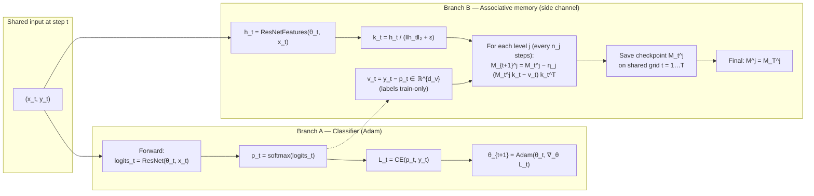
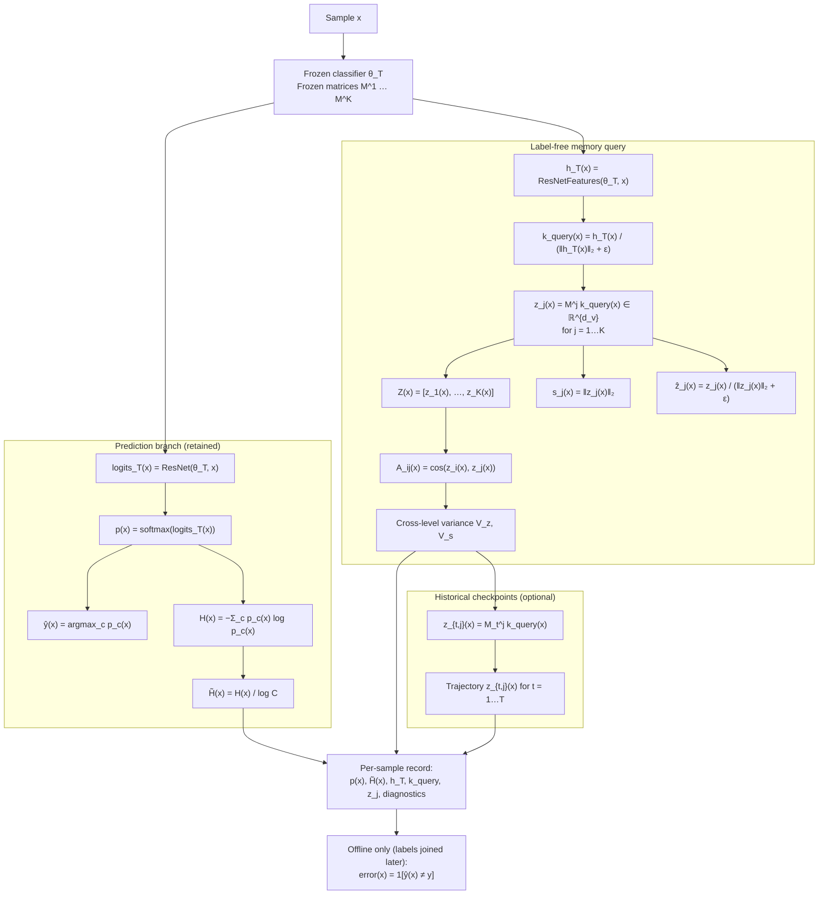
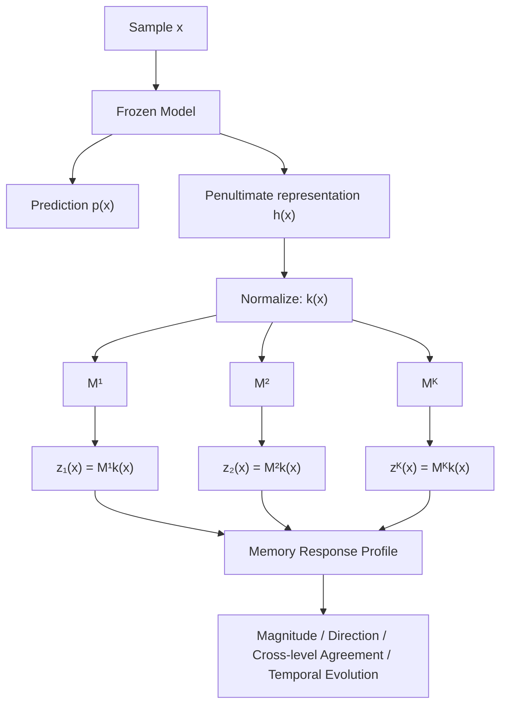

# Deployment Pipeline — Historical Associative Memory

## Objective

Implement the deployment-time inference pipeline for the current associative-memory mechanism.

The goal is to determine whether the model's **historical prediction-correction behavior** provides useful information about the reliability of the current prediction.

Do **not** redesign the memory mechanism.

---

## Pipeline Diagrams

### 1. Training pipeline (classifier + associative memory, side by side)

Shared mini-batch at step \(t\). **Branch A** updates ResNet-18 with Adam. **Branch B** observes the same forward pass, uses labels only for \(v_t=y_t-p_t\), and updates \(\{M_t^j\}\) on independent schedules. After training, both \(\theta_T\) and \(\{M^j=M_T^j\}\) are frozen.



**Level schedules (DermaMNIST):** \(n_j \in \{1,4,16,64\}\), \(\eta_j \in \{0.1, 0.05, 0.01, 0.005\}\), \(d_k{=}512\), \(d_v{=}C{=}7\).

---

### 2. Deployment / inference pipeline (frozen model + frozen memory)

No labels at inference. Do **not** compute \(v=y-p\). Query key uses frozen penultimate features \(h_T(x)\) (train/deploy note: memory was built with moving \(k_t\), queried with \(k_{\mathrm{query}}\)).



**Core deployment identity (every level):**

\[
x \rightarrow h_T(x) \rightarrow k_{\mathrm{query}}(x) \rightarrow z_j(x)=M^j k_{\mathrm{query}}(x).
\]

---

## 1. Deployment Pipeline

For each deployment sample:

\[
x \rightarrow h(x) \rightarrow k(x) \rightarrow M^{(j)}k(x)
\]

where:

\[
h(x)=\text{penultimate-layer representation}
\]

\[
k(x)=\frac{h(x)}{\|h(x)\|+\epsilon}
\]

The model and memories are frozen during deployment.

The ordinary prediction is retained:

\[
p(x)
\]

and for every memory level:

\[
z_j(x)=M^{(j)}k(x).
\]

For \(K\) levels:

\[
Z(x)=[z_1(x),z_2(x),...,z_K(x)].
\]

See **§Pipeline Diagrams → 2. Deployment / inference pipeline** for the full equation-annotated flowchart.

<!--
Legacy compact diagram (superseded by Pipeline Diagrams §2):


-->

---

## 2. What Is Compared?

**Do not compare raw \(x\) with \(M\).**

They exist in different spaces.

The correct relationship is:

\[
x \rightarrow h(x) \rightarrow k(x) \rightarrow M^{(j)}k(x).
\]

The key \(k(x)\) is the object presented to memory.

Conceptually:

\[
M^{(j)}\sim\sum_t v_tk_t^\top
\]

so:

\[
M^{(j)}k(x)\sim\sum_t v_t\left(k_t^\top k(x)\right).
\]

Because keys are normalized:

\[
k_t^\top k(x)=\cos(k_t,k(x)).
\]

Thus memory retrieval is a **similarity-weighted historical prediction-correction response**.

Do not call this directly "familiarity" or "uncertainty" yet.

---

## 3. Memory Measurements

For each level:

### Response

\[
z_j(x)=M^{(j)}k(x)
\]

### Magnitude

\[
s_j(x)=\|z_j(x)\|_2
\]

### Direction

\[
\hat z_j(x)=\frac{z_j(x)}{\|z_j(x)\|_2+\epsilon}
\]

### Cross-level agreement

\[
A_{ij}(x)=\cos(z_i(x),z_j(x))
\]

### Cross-level variance

\[
V_z(x)=\operatorname{Var}_j(z_j(x))
\]

\[
V_s(x)=\operatorname{Var}_j(\|z_j(x)\|_2).
\]

These are **diagnostic memory features**, not assumed uncertainty measures.

---

## 4. Historical Checkpoints

If historical memory checkpoints are available, also compute:

\[
z_{t,j}(x)=M_t^{(j)}k(x).
\]

This produces the memory-response trajectory:

\[
\{z_{t,j}(x)\}_{t=1}^{T}.
\]

Distinguish clearly between:

- **Stored memory:** \(M_t^{(j)}\)
- **Query-specific response:** \(z_{t,j}(x)=M_t^{(j)}k(x)\)

---

## 5. Deployment Output

For every sample, store:

```text
sample_id

prediction:
    probabilities p(x)
    predicted_class
    entropy

representation:
    h(x)
    key k(x)

memory:
    level_j:
        response_vector z_j(x)
        magnitude
        normalized_direction

    cross_level:
        pairwise_cosine_agreement
        response_variance
        magnitude_variance

optional_history:
    checkpoint_t:
        z_t,1(x), ..., z_t,K(x)
```

Do not use \(y\) during deployment.

Do not calculate:

\[
v=y-p.
\]

Ground truth can only be joined later for offline evaluation.

---

## 6. Offline Evaluation

After deployment outputs are generated, evaluate memory information against true error:

\[
\text{error}(x)=\mathbf 1[\hat y(x)\neq y].
\]

Also calculate prediction entropy:

\[
H(x)=-\sum_c p_c(x)\log p_c(x)
\]

and normalized entropy:

\[
\tilde H(x)=\frac{H(x)}{\log C}.
\]

Compare:

1. **Prediction only**
   \[
   H(x)\rightarrow\text{error}
   \]

2. **Memory only**
   \[
   z(x)\rightarrow\text{error}
   \]

3. **Combined**
   \[
   [H(x),z(x)]\rightarrow\text{error}
   \]

The key question is whether historical memory contains information **beyond ordinary predictive uncertainty**.

---

## 7. Do Not Build Final Deferral Score Yet

Do not assume:

\[
z(x)=\text{uncertainty}
\]

or

\[
\|z(x)\|=\text{familiarity}.
\]

Do not yet create a final risk/deferral score or combine entropy and memory.

First establish what information is actually contained in the retrieved memory response.

---

## 8. Sanity Checks

Verify:

\[
k(x)\in\mathbb R^{d_k}
\]

\[
M^{(j)}\in\mathbb R^{d_v\times d_k}
\]

\[
M^{(j)}k(x)\in\mathbb R^{d_v}.
\]

Also verify:

- \(\|k(x)\|_2\approx1\)
- deployment requires no labels
- model and memory remain unchanged
- batch and single-sample inference agree
- manual \(M^{(j)}k(x)\) matches implementation
- numerical safeguards handle near-zero norms

---

## 9. Implementation Deliverables

Implement:

1. Deployment inference module.
2. Querying for all memory levels.
3. Optional historical-checkpoint querying.
4. Per-sample structured outputs.
5. Memory-response diagnostics.
6. Sanity checks.
7. Evaluation/visualization of:
   - entropy,
   - memory magnitude,
   - cross-level agreement,
   - temporal trajectories,
   - relationship with prediction errors.

**Do not implement a final deferral policy yet.**

The immediate objective is to establish exactly what the historical associative memory retrieves for a new sample.
