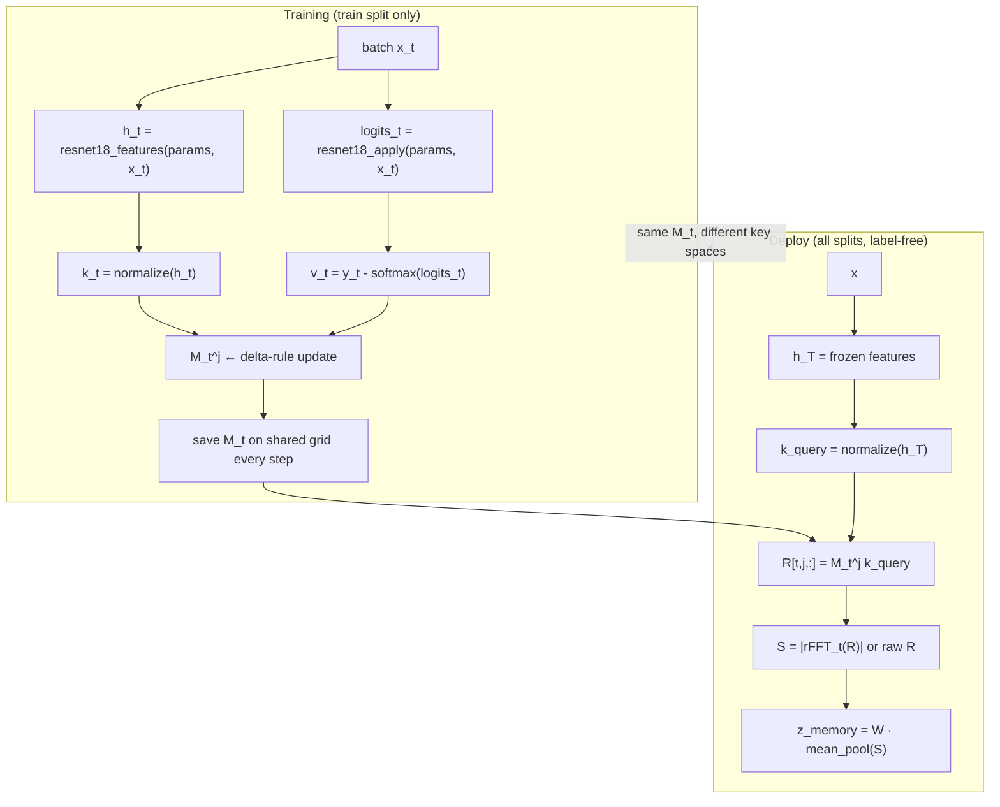

# Associative Memory Implementation — Audit, Equations & Experiment Results

**Purpose:** Single reference for understanding, auditing, and debugging the associative learning-trajectory memory pipeline (replacing nested EMA memory). Covers every equation, implementation step, code touchpoint, and **embedded results** from the DermaMNIST full-validation run (2026-09-07).

**Entry points:**
- Plan: `.cursor/plans/associative-memory-fft-attention.plan.md`
- Interface map: `docs/MEMORY_IMPLEMENTATION_NOTE.md`
- Primary notebook: `notebooks/dermamnist_full_validation.ipynb`
- Cross-dataset notebook: `notebooks/retinamnist_organcmnist_deferral.ipynb`
- Artifacts root: `research/associative_memory_fft/artifacts/`

---

## Table of contents

1. [Executive summary & verdict](#1-executive-summary--verdict)
2. [Notation & frozen vs changed components](#2-notation--frozen-vs-changed-components)
3. [Pipeline overview](#3-pipeline-overview)
4. [Step 0 — Setup & configuration](#step-0--setup--configuration)
5. [Step 1 — Classifier training + associative side-channel](#step-1--classifier-training--associative-side-channel)
6. [Step 2 — Memory reconstruction diagnostics](#step-2--memory-reconstruction-diagnostics)
7. [Step 3 — Memory identification (failure detection)](#step-3--memory-identification-failure-detection)
8. [Step 4 — NRO conditional information (H vs H+N)](#step-4--nro-conditional-information-h-vs-hn)
9. [Step 5 — MSA linear deferral (H vs H+N)](#step-5--msa-linear-deferral-h-vs-hn)
10. [Step 6 — Incremental deferral (primary: H+h vs H+h+z)](#step-6--incremental-deferral-primary-hh-vs-hhz)
11. [Step 7 — Ablations (raw trajectory, no-attention)](#step-7--ablations-raw-trajectory-no-attention)
12. [Step 8 — Cross-dataset deferral](#step-8--cross-dataset-deferral)
13. [Old vs new memory paths](#13-old-vs-new-memory-paths)
14. [Artifact layout & file map](#14-artifact-layout--file-map)
15. [Debugging checklist](#15-debugging-checklist)
16. [Known failure modes (from results)](#16-known-failure-modes-from-results)

---

## 1. Executive summary & verdict

### Scientific question

Does **historical optimization memory** add failure-detection / deferral signal beyond the current representation \(h_T(x)\)?

**Primary comparison (pre-registered):**

\[
\text{H} + h \quad\text{vs}\quad \text{H} + h + z_{\text{memory}}
\]

Do **not** treat H vs H+z as the primary question.

### Overall verdict: **FAIL**

| Criterion (plan § scientific decision rule) | Result |
|---------------------------------------------|--------|
| H+h+z beats H+h (95% CI on Δ selective risk excludes 0) | **No** — Δ ≈ −0.00015, CI includes 0 |
| Random control does not reproduce gain | **No** — z_random ≈ z_actual |
| Reconstruction \(L^j(k) \approx v\) is good | **No** — mean cosine 0.18–0.31; highly bimodal per sample |

Consolidated numbers: `artifacts/verdict_draft.json`

### What passed vs what failed

| Experiment | Memory signal tested | Verdict |
|------------|---------------------|---------|
| §2 Reconstruction | Associative \(M_T k_T\) vs \(v=y-p\) | **FAIL gate** — weak aggregate fit |
| §3 Memory ID exp1 | Old label-dependent **N_actual** (EMA) | **INCONCLUSIVE** — random ≈ actual |
| §3 Memory ID exp2 | New **z_memory** | **FAIL** — no gain over H+h |
| §4 NRO | Old **N** (`memory_novelty`) | **PASS** — but **not** associative z |
| §5 Deferral | Old **H+N** | **FAIL** |
| §6 Incremental deferral | New **H+h+z_actual** | **FAIL / INCONCLUSIVE** |
| §7 Ablations | Old **H+N** with toggles | **FAIL** |
| Cross-dataset | New **H+h+z** | **INCONCLUSIVE** — inconsistent signs |

---

## 2. Notation & frozen vs changed components

### Symbols

| Symbol | Definition | Label-free at deploy? |
|--------|------------|----------------------|
| \(x\) | Input image | — |
| \(h_T(x)\) | Frozen penultimate ResNet-18 features after training | Yes |
| \(h_t(x)\) | Penultimate features at training step/epoch \(t\) (moving) | Yes |
| \(H(x)\) | Predictive entropy \(-\sum_c p_c \log p_c\) | Yes |
| \(h(x)\) | Linear projection of \(h_T(x)\) (fixed map, dim ≪ \(d_h\)) | Yes |
| \(k_t\) | \(\mathrm{normalize}(h_t(x_t))\) — training key | Yes |
| \(k_{\text{query}}\) | \(\mathrm{normalize}(h_T(x))\) — deploy key | Yes |
| \(p_t\) | \(\mathrm{softmax}(\text{logits}_t)\) | Yes |
| \(v_t\) | \(y_t - p_t\) (one-hot minus softmax; \(d_v =\) num classes) | **Uses \(y\) at train only** |
| \(M_t^j\) | Associative matrix at global step \(t\), level \(j \in \{1,\ldots,K\}\) | — |
| \(L^j(k)\) | \(M^j k\) — retrieval at one level | Yes |
| \(R(x)\) | Trajectory \(R[t,j,:] = M_t^j k_{\text{query}}(x)\) | Yes |
| \(S(x)\) | Spectral tokens \(\|\mathrm{rFFT}_t(R)\|\) or raw \(R\) | Yes |
| \(z_{\text{memory}}\) | Mean-pool of \(S\) + fixed Gaussian projection | Yes |
| \(N\) / `memory_novelty` | Old EMA gradient-alignment novelty | **No** — needs `example_grad(x,y)` |

### Frozen (do not change)

- Dataset / splits (`research/common/clinical_datasets.py`)
- ResNet-18 classifier (`research/common/resnet.py`)
- Adam optimizer for classifier (`research_nrm_v2_observe`)
- LR, batch size, epochs, seeds (`ClinicalTrainingConfig`)
- Experiment drivers (Python modules; notebooks are entry points only)

### Changed (memory only)

```
nested EMA long_term  →  associative M^j  →  checkpoint grid  →  R(x)  →  FFT  →  z_memory
```

**Modules added:** `optimizer/associative_memory.py`, `research/common/trajectory_store.py`, `research/common/spectral_memory.py`, `research/common/associative_attention.py`

**Modules patched:** `clinical_training.py`, `memory.py`, `msa.py`, `msa_linear_deferral.py`, `memory_identification.py`

---

## 3. Pipeline overview



**Critical design tension:** \(M_t\) is **trained** with \(k_t = \mathrm{normalize}(h_t)\) but **queried** with \(k_{\text{query}} = \mathrm{normalize}(h_T)\). See [§16](#16-known-failure-modes-from-results).

---

## Step 0 — Setup & configuration

### Equations

None — imports and config only.

### Protocol defaults (DermaMNIST full validation)

```python
TASK = "dermamnist"
SEEDS = (42, 123, 456)
EPOCHS = 8
ASSOC_CFG = AssociativeMemoryConfig(use_fft=True, use_attention=False)
OUTPUT_DIR = research/associative_memory_fft/artifacts
```

| Toggle | Value | Effect |
|--------|-------|--------|
| `use_fft` | `True` | \(S = \|\mathrm{rFFT}_t(R)\|\) along checkpoint axis |
| `use_attention` | `False` | Deterministic mean-pool + fixed projection (not learned MHA) |
| `trajectory_sample_every` | `1` | Checkpoint every global training step |
| `num_levels` | `4` | Independent \(M^j\), not nested EMA |

### Level schedule (independent, not nested)

| Level \(j\) | Update every \(N\) steps | Learning rate \(\eta_j\) |
|-------------|--------------------------|--------------------------|
| L¹ | 1 | 0.1 |
| L² | 4 | 0.05 |
| L³ | 16 | 0.01 |
| L⁴ | 64 | 0.005 |

**Code:** `optimizer/associative_memory.py` — `DEFAULT_UPDATE_EVERY`, `DEFAULT_LEARNING_RATES`

### Results

Setup completed successfully (`imports ok`). No numerical results at this step.

---

## Step 1 — Classifier training + associative side-channel

### Equations

**Classifier (unchanged):** ResNet-18 + Adam via `research_nrm_v2_observe`.

**Associative update (train split, after each batch):**

\[
k_t = \frac{h_t(x_t)}{\|h_t(x_t)\|_2 + \varepsilon}
\]

\[
v_t = y_t - p_t, \quad p_t = \mathrm{softmax}(\text{logits}_t)
\]

**Batch-mean delta rule** (per level \(j\), when `global_step % update_every[j] == 0`):

\[
M_{t+1}^j = M_t^j - \eta_j \cdot \frac{1}{B}\sum_{i=1}^{B} \big(M_t^j k_{t,i} - v_{t,i}\big)\, k_{t,i}^\top
\]

Single-sample (\(B=1\)) uses the same rule without averaging.

**Checkpoint grid** (shared across all samples):

\[
\text{checkpoint\_steps} = [t_1 < t_2 < \cdots < t_T]
\]

Saved object shape: `matrices` \((T, K, d_v, d_k)\)

**Deploy replay (post-training, label-free):**

\[
k_{\text{query}}(x) = \frac{h_T(x)}{\|h_T(x)\|_2 + \varepsilon}, \qquad
R[\ell, j, :](x) = M_{t_\ell}^j\, k_{\text{query}}(x)
\]

### Implementation steps

1. `train_one_seed()` loops epochs over **train split only** for \(M\) updates.
2. After each batch forward: compute `h_batch`, `logits`, then `k_batch`, `v_batch`.
3. `assoc_mem.update(k_batch, v_batch)` — advances `AssociativeMemoryState`.
4. `checkpoint_store.save_memory_checkpoint(global_step, state)` — every step (`sample_every=1`).
5. After training: freeze checkpoints, save `*_associative.npz` (final \(M_T\)) and `*_checkpoints.npz`.
6. NRM v2 nested EMA (`long_term`) still runs in observe mode but is **not** consumed by new z path.

### Code map

| Step | File | Function |
|------|------|----------|
| Training loop | `research/common/clinical_training.py` | `train_one_seed()` |
| Delta rule | `optimizer/associative_memory.py` | `batch_delta_rule_step()`, `associative_update()` |
| Value signal | `optimizer/associative_memory.py` | `value_from_logits()` |
| Key normalize | `optimizer/associative_memory.py` | `normalize_key()` |
| Checkpoint store | `research/common/trajectory_store.py` | `MemoryCheckpointStore` |
| Save/load | `research/common/memory.py` | `save_associative_memory()`, `load_associative_artifacts()` |

### Hyperparameters (this run)

| Parameter | Value |
|-----------|-------|
| Train samples | 6408 |
| Batch size | 64 |
| Batches/epoch | ~101 |
| Epochs | 8 |
| Global steps | ~808 |
| Checkpoint count \(T\) | **808** |
| \(d_k\) | 512 (ResNet-18 penultimate) |
| \(d_v\) | 7 (DermaMNIST classes) |

### Results — training accuracy

| Seed | Final test acc | Checkpoint count \(T\) |
|------|----------------|------------------------|
| 42 | 0.739 | 808 |
| 123 | 0.719 | 808 |
| 456 | 0.734 | 808 |

**Epoch trace (seed 42):**

| Epoch | Train loss | Cal acc | Test acc |
|-------|------------|---------|----------|
| 1 | 0.964 | 0.660 | 0.660 |
| 4 | 0.781 | 0.710 | 0.697 |
| 8 | 0.672 | 0.728 | **0.739** |

**Audit notes:**
- Non-finite \(M\) raises `AssociativeMemoryNaNError` — training would abort (no silent zeroing).
- Old EMA memory also saved to `*_memory.npz` for baseline comparisons.

---

## Step 2 — Memory reconstruction diagnostics

### Equations

**Diagnostic only (uses labels on train probe set):**

\[
\hat{v}^j = M_T^j\, k_{\text{query}}, \qquad k_{\text{query}} = \mathrm{normalize}(h_T(x))
\]

\[
\text{MSE}^j = \frac{1}{d_v}\|\hat{v}^j - v\|_2^2, \qquad
\text{cosine}^j = \frac{\hat{v}^j \cdot v}{\|\hat{v}^j\|\,\|v\|}
\]

where \(v = y - \mathrm{softmax}(\text{logits})\) at **frozen** \(h_T\).

**Plan gate:** Do not proceed to downstream claims if reconstruction is poor.

### Implementation

- Notebook §2: 64 train samples × 3 seeds.
- `memory_reconstruction_diagnostics(state, keys, values)` in `research/common/memory.py`.
- Output: `artifacts/memory_reconstruction_diagnostics.csv`

### Results — aggregate (mean over 64 probes × 3 seeds)

| Level | Mean MSE | Mean cosine |
|-------|----------|-------------|
| L¹ | 0.0409 | **0.313** |
| L² | 0.0408 | 0.220 |
| L³ | 0.0407 | 0.220 |
| L⁴ | 0.0408 | **0.180** |

Source: `artifacts/verdict_draft.json` → `reconstruction`

### Results — interpretation

| Observation | Implication |
|-------------|-------------|
| All levels share ~same MSE | Levels are **not** specializing |
| Cosine degrades L¹→L⁴ | Slower levels fit **worse**, not better |
| Per-sample spread is bimodal | Many cos ≈ 0.9+, many **negative** cos |
| Gate threshold (informal: median cos > 0.5) | **FAIL** |

**Example per-sample extremes (seed 42):**

| sample_idx | level | MSE | cosine |
|------------|-------|-----|--------|
| 10 | 1 | 0.0009 | 0.976 |
| 53 | 1 | 0.228 | −0.831 |
| 3 | 1 | 0.159 | −0.853 |

### Cheap synthetic diagnostics (pre-flight)

Path: `artifacts/spec_correction_diagnostics/`

| Check | Result |
|-------|--------|
| NaN/Inf in \(R\) | 0 |
| `finite_R` | True |
| Synthetic \(T\) | 8 steps (smoke only — not full run) |

---

## Step 3 — Memory identification (failure detection)

### Equations

**Experiment 1 — logistic failure prediction on external (DermaMNIST-E):**

\[
\mathbb{P}(\text{error} \mid \mathbf{f}), \quad \mathbf{f} \in \{\,H,\; h,\; N,\; H\!+\!N,\; H\!+\!G,\; \ldots\,\}
\]

- **N_actual** = old `memory_novelty` from gradient × EMA memory (**label-dependent**).
- Compare AUROC; random-memory control: `randomize_associative_memory()`.

**Experiment 2 — deferral ladder (simulated human deferral):**

Methods: `H`, `H+h`, `H+h+z_memory`, `H+h+z_rand`, `H+z_actual`, `H+z_rand`

**z_memory construction (label-free):**

\[
R[\ell,j,:] = M_{t_\ell}^j k_{\text{query}}, \quad
S = \|\mathrm{rFFT}_\ell(R)\|, \quad
z_{\text{memory}} = W \cdot \mathrm{mean}_{\ell,j}(S)
\]

### Code map

`research/memory_identification/memory_identification.py` — `run_memory_identification()`

### Results — Experiment 1 (mean AUROC, 3 seeds)

| Method | uses_y | uses_actual_memory | AUROC mean | AUPRC mean |
|--------|--------|-------------------|------------|------------|
| CE | Yes | No | **0.993** | 0.982 |
| H+CE | Yes | No | **0.996** | 0.989 |
| H+G | Yes | No | 0.886 | 0.631 |
| H | No | No | 0.815 | 0.564 |
| H+N_actual | Yes | Yes | 0.842 | 0.595 |
| H+N_rand (mean) | Yes | No | 0.854 | 0.604 |
| N_actual | Yes | Yes | 0.586 | 0.434 |

Source: `artifacts/memory_identification/experiment1_aggregate.csv`

**Key paired deltas:**

| Comparison | Δ AUROC | Interpretation |
|------------|---------|----------------|
| H+N_actual − H+N_rand | **−0.0126** | Actual memory **does not** beat random |
| H+N_actual − H+G | **−0.0440** | Gradient norm control **beats** memory |

**Evidence class:** **B** — partial; simpler controls explain part of gain.

### Results — Experiment 2 (mean selective risk over seeds; lower is better)

| Method | Selective risk | Deferral precision | Error capture |
|--------|----------------|--------------------|---------------|
| H | **0.198** | 0.602 | 0.419 |
| H+h | 0.214 | 0.525 | 0.377 |
| H+h+z_memory | 0.207 | 0.524 | 0.406 |
| H+h+z_rand | 0.214 | 0.517 | 0.378 |
| H+z_actual | 0.209 | 0.580 | 0.374 |
| H+z_rand | 0.213 | 0.569 | 0.361 |

Source: `artifacts/memory_identification/interpretation.md`

**Verdict for z_memory:** No consistent improvement over H alone; H+h+z ≈ H+h+z_rand.

---

## Step 4 — NRO conditional information (H vs H+N)

### Equations

**Conditional log-loss comparison:**

\[
\Delta L = L(H) - L(H + N)
\]

where \(N\) = `memory_novelty` from **old EMA** path (label-dependent at scoring time).

Bootstrap 95% CI on pooled external test (6015 samples, 3 seeds).

### Important audit note

This step tests **old nested-EMA novelty**, **not** associative \(z_{\text{memory}}\). A PASS here does **not** validate the new memory implementation.

### Code map

`research/common/nro_final_experiment.py` — `run_nro_final_experiment()`, `n_col="memory_novelty"`

### Results — per seed & pooled

| Seed | \(L_H\) | \(L_{H+N}\) | ΔL | AUROC_H | AUROC_{H+N} | Passed |
|------|---------|-------------|-----|---------|-------------|--------|
| 42 | 0.447 | 0.446 | +0.00002 | 0.813 | 0.814 | No |
| 123 | 0.433 | 0.419 | **+0.0141** | 0.844 | 0.858 | **Yes** |
| 456 | 0.454 | 0.416 | **+0.0374** | 0.804 | 0.851 | **Yes** |
| **pooled** | 0.444 | 0.427 | **+0.0172** | 0.820 | 0.842 | **Yes** |

Pooled ΔL 95% CI: **[0.0125, 0.0223]** — excludes zero.

Source: `artifacts/nro_final/results.csv`, `decision_gate.json` (`hypothesis_supported: true`)

---

## Step 5 — MSA linear deferral (H vs H+N)

### Equations

**Deferral at target rate** (~20%): sort by linear scorer, defer highest-risk fraction.

\[
R_{\text{selective}} = \frac{\#\{\text{errors in accepted}\}}{\#\{\text{accepted}\}}
\]

**Scorers compared:** `H`, `N` (memory novelty alone), `H+N`

Again: uses **old EMA N**, not \(z_{\text{memory}}\).

### Code map

`research/common/msa_linear_deferral.py` — `run_msa_linear_deferral_experiment()`

### Results — pooled external (6015 samples)

| Scorer | Selective risk ↓ | Deferral precision | Error capture | AUROC |
|--------|------------------|--------------------|--------------:|------:|
| H | **0.1876** | **0.6040** | **0.4358** | 0.8209 |
| N | 0.2039 | 0.5415 | 0.3844 | 0.7959 |
| H+N | 0.1918 | 0.5879 | 0.4228 | 0.8208 |

Δ selective risk (Risk_H − Risk_{H+N}): **−0.0042**  
95% CI: **[−0.0098, 0.0013]** — includes zero.

**Verdict:** **FAIL** (`artifacts/deferral/FINAL_VERDICT.md`)

---

## Step 6 — Incremental deferral (primary: H+h vs H+h+z)

### Equations

**Primary hypothesis:**

\[
\Delta_R = R(\text{H}+h) - R(\text{H}+h+z_{\text{actual}})
\]

Positive ΔR means z_memory **reduces** selective risk (improves deferral).

**Random control:**

\[
\Delta_R^{\text{rand}} = R(\text{H}+h+z_{\text{actual}}) - R(\text{H}+h+z_{\text{random}})
\]

\(z_{\text{random}}\): same \(k_{\text{query}}\), but each \(M_t^j\) replaced by Frobenius-norm-matched Gaussian matrix on the same checkpoint grid.

**Bootstrap:** 2000× resamples, seed 20260829, 95% CI.

### Code map

`research/incremental_memory_deferral/incremental_memory_deferral.py`

### Results — pooled deferral metrics (DermaMNIST-E, 6015 samples)

| Method | Selective risk | Deferral precision | Error capture | Deferral rate |
|--------|----------------|--------------------|--------------:|--------------:|
| H | **0.1876** | **0.6040** | **0.4358** | 0.194 |
| H+h | 0.1963 | 0.5612 | 0.4123 | 0.197 |
| **H+h+z_actual** | 0.1964 | 0.5598 | 0.4123 | 0.198 |
| H+h+z_random | 0.1970 | 0.5562 | 0.4110 | 0.198 |

Overall risk (no deferral): 0.2682

Source: `artifacts/incremental_deferral/incremental_deferral_pooled.csv`

### Results — paired bootstrap CIs

| Comparison | Δ selective risk (mean) | 95% CI | CI excludes 0? |
|------------|--------------------------|--------|----------------|
| H+h vs H+h+z_actual (pooled) | −0.00015 | [−0.00125, 0.00096] | **No** |
| H+h vs H+h+z_actual (per seed) | −0.00011 | [−0.00244, 0.00189] | **No** |
| z_actual vs z_random (pooled) | −0.00056 | [−0.00211, 0.00093] | **No** |
| z_actual vs z_random (per seed) | −0.00064 | [−0.00429, 0.00257] | **No** |

Source: `artifacts/incremental_deferral/incremental_deferral_paired_ci.csv`

**Verdict:** **FAIL / INCONCLUSIVE** — this is the definitive test of associative \(z_{\text{memory}}\).

---

## Step 7 — Ablations (raw trajectory, no-attention)

### Equations

Same as Step 5 deferral protocol, with toggles:

| Ablation | Config | Token path |
|----------|--------|------------|
| `z_raw` | `use_fft=False` | \(S = \mathrm{reshape}(R)\) — raw trajectory tokens |
| `z_no_attn` | `use_attention=False` | Same as primary (already mean-pool) |

**Note:** Primary run already uses `use_attention=False`. The `z_no_attn` folder confirms the same H vs H+N baseline outcome.

### Results — pooled (H vs H+N, same as §5)

Both ablation runs report **FAIL** with identical H / H+N numbers:

| Scorer | Selective risk | AUROC |
|--------|----------------|-------|
| H | 0.1876 | 0.8209 |
| H+N | 0.1918 | 0.8208 |

Paths:
- `artifacts/deferral_ablation_z_raw/FINAL_VERDICT.md`
- `artifacts/deferral_ablation_z_no_attn/FINAL_VERDICT.md`

**Interpretation:** Turning off FFT does not rescue the old N signal; primary z failure is unrelated to this ablation axis.

---

## Step 8 — Cross-dataset deferral

### Protocol

Secondary notebook: RetinaMNIST + OrganAMNIST deferral only (no full memory-ID / NRO).

Compare **H+h+z_actual − H+h** selective risk.

### Results — pooled selective risk

| Task | H | H+h | H+h+z_actual | H+h+z_random | ΔR(z−h) |
|------|---|-----|--------------|--------------|---------|
| DermaMNIST | 0.247 | 0.293 | 0.301 | 0.301 | **+0.0085** |
| RetinaMNIST | 0.455 | 0.463 | 0.463 | 0.464 | **+0.0006** |
| OrganAMNIST | 0.430 | 0.470 | 0.460 | 0.467 | **−0.0098** |

Source: `cross_dataset/cross_dataset_deferral.csv`, `cross_dataset_summary.md`

**RetinaMNIST incremental (pooled):** ΔR(H+h − H+h+z) = **−0.0006**, CI excludes 0: **No**

**Verdict:** No cross-dataset generalization; signs disagree.

---

## 13. Old vs new memory paths

### Side-by-side

| Property | Old (nested EMA) | New (associative) |
|----------|------------------|-------------------|
| State | `long_term` param-tree per level | \(M^j \in \mathbb{R}^{d_v \times d_k}\) |
| Update input | Slow gradient signal \(A_t\) | \(k_t\), \(v_t = y-p\) |
| Update rule | Nested EMA | Delta rule |
| Query at deploy | Per-sample gradient \(\hat{g}\) | \(k_{\text{query}} = \mathrm{normalize}(h_T)\) |
| Output N | `memory_novelty` (label-dependent) | — |
| Output z | MHA over flattened EMA | Mean-pool of FFT trajectory |
| Used in §4/§5 | **Yes** | **No** |
| Used in §6 | **No** | **Yes** |

### z_memory full equation chain

1. **Retrieve per level:** \(L^j = M^j k_{\text{query}}\)
2. **Trajectory:** \(R[t,j,:] = L^j\) at checkpoint \(t\) (with frozen \(k_{\text{query}}\))
3. **Spectral:** \(S = |\mathrm{rFFT}_t(R)|\) → shape \((K \cdot T_{\text{freq}}, d_v)\) where \(T_{\text{freq}} = T/2 + 1\)
4. **Aggregate (primary):** \(\bar{s} = \mathrm{mean}_{\text{tokens}}(S)\), then \(z = W \bar{s}\) with fixed Gaussian \(W\) (`aggregation_seed=0`, `d_out=128`)

**Code chain:** `build_query_trajectory` → `temporal_fft_features` → `retrieve_z_memory` (mean_pool path)

With \(T=808\): ~\(4 \times 405 = 1620\) tokens of dim 7 → mean-pooled to 7-d → projected to 128-d.

---

## 14. Artifact layout & file map

```
research/associative_memory_fft/
├── IMPLEMENTATION_AUDIT.md          ← this file
├── README.md                        ← spec definitions
├── artifacts/
│   ├── verdict_draft.json           ← §2+§6 summary JSON
│   ├── memory_reconstruction_diagnostics.csv
│   ├── memory/                      ← *_associative.npz, *_checkpoints.npz
│   ├── memory_identification/       ← §3
│   ├── nro_final/                   ← §4
│   ├── deferral/                    ← §5
│   ├── incremental_deferral/        ← §6 (PRIMARY)
│   ├── deferral_ablation_z_raw/     ← §7
│   ├── deferral_ablation_z_no_attn/ ← §7
│   └── spec_correction_diagnostics/ ← cheap pre-flight
└── cross_dataset/                   ← §8
```

### Key Python modules by pipeline stage

| Stage | Module | Key symbols |
|-------|--------|-------------|
| Update | `optimizer/associative_memory.py` | `AssociativeMemory`, `associative_update`, `value_from_logits` |
| Checkpoints | `research/common/trajectory_store.py` | `MemoryCheckpointStore`, `build_query_trajectory` |
| FFT | `research/common/spectral_memory.py` | `temporal_fft_features` |
| z retrieval | `research/common/associative_attention.py` | `retrieve_z_memory`, `mean_pool_tokens` |
| Batch z | `research/common/msa.py` | `batch_associative_z_memory` |
| Training | `research/common/clinical_training.py` | `train_one_seed` |
| Diagnostics | `research/common/memory.py` | `memory_reconstruction_diagnostics` |
| Deferral | `research/common/msa_linear_deferral.py` | `run_msa_linear_deferral_experiment` |
| Incremental | `research/incremental_memory_deferral/` | `run_incremental_memory_deferral` |

---

## 15. Debugging checklist

Use this when auditing a run or investigating null results.

### A. Training integrity

- [ ] `checkpoint_count` ≈ `(n_train / batch_size) * epochs` → expect **808** for this run
- [ ] No `AssociativeMemoryNaNError` during training
- [ ] `*_checkpoints.npz` exists with `matrices.shape = (T, K, d_v, d_k)`
- [ ] `checkpoint_steps` strictly increasing
- [ ] Final step checkpoint equals `*_associative.npz` final \(M_T\)

### B. Key consistency (most common bug class)

- [ ] Training uses `normalize(h_t)` — moving representation
- [ ] Deploy uses `normalize(h_T)` — frozen representation
- [ ] Reconstruction diagnostic explicitly documents which key is used (notebook: \(h_T\))
- [ ] Compare `cos(M k_T, v)` vs `cos(M k_t, v)` at same sample — if latter ≫ former, deploy object is inconsistent with training

### C. Trajectory integrity

- [ ] All splits share identical \(T, K\)
- [ ] No T=1 fallback (raises `MissingMemoryCheckpointsError` if missing)
- [ ] `R[t,j,:] = M_t^j @ k_query` — not `M_t^j @ k_t`, not per-sample visit packing
- [ ] Random control preserves Frobenius norm of each \(M_t^j\)

### D. z_memory path

- [ ] `use_attention=False` → no untrained WQ/WK/WV
- [ ] `use_fft=True` → FFT on axis \(t\) of \(R\), magnitude only
- [ ] Mean-pool + `aggregation_seed` deterministic
- [ ] z_actual vs z_random correlation — if ≈ 1, aggregation erases memory identity

### E. Experiment wiring

- [ ] §4/§5 use `memory_novelty` (old N) — **not** z_memory
- [ ] §6 uses `batch_associative_z_memory` — **the** new memory test
- [ ] Do not cite §4 PASS as evidence for associative memory

### F. Label leakage

| Signal | Label at deploy? |
|--------|------------------|
| z_memory | **No** |
| N_actual / memory_novelty | **Yes** (needs grad w.r.t. loss with y) |
| v_t in memory update | Yes, but train-only |

---

## 16. Known failure modes (from results)

Ordered by likely impact on this run's **FAIL** verdict.

### 1. Train/deploy key mismatch

- **Train:** \(M\) learns associations for \(k_t = \mathrm{normalize}(h_t(x))\) where \(h_t\) shifts ~8 epochs.
- **Deploy:** \(R[t,j,:] = M_t^j\, \mathrm{normalize}(h_T(x))\) — same \(k_T\) at every checkpoint \(t\).
- Early \(M_t\) were never fit for \(h_T\) geometry.
- **Symptom:** Reconstruction weak even at final \(M_T\); trajectory temporal axis reflects matrix drift under wrong query, not sample history.

### 2. Weak value reconstruction

- Aggregate cosine 0.18–0.31 fails §2 gate.
- Levels do not differentiate (MSE ≈ 0.041 all levels).
- **Symptom:** z_memory has little predictable structure from \(M k_{\text{query}}\).

### 3. Mean-pool information collapse

- With \(T=808\), FFT produces ~1620 tokens × 7 dims → single mean → 128-d projection.
- **Symptom:** z_actual ≈ z_random in §6 (Δ selective risk −0.00056, CI includes 0).

### 4. Value target misalignment

- \(v = y - p\) captures training-time prediction residual, not external-shift failure.
- External eval (DermaMNIST-E) tests distribution shift, not memorized residuals.
- **Symptom:** H alone beats H+h+z in several metrics.

### 5. Batch-mean interference

- Delta rule averages outer products over batch \(B=64\).
- Competing samples overwrite each other's associations in shared \(M^j\).
- **Symptom:** High per-sample variance in reconstruction (some perfect, many anti-correlated).

### 6. Experiment path confusion

- §4 NRO **PASS** uses old EMA N — can mislead if read as validation of new memory.
- **Audit rule:** Only §2 (reconstruction) and §6 (incremental deferral) test associative z directly.

---

## Appendix A — Spectral token dimensions

For trajectory \(R \in \mathbb{R}^{T \times K \times d_v}\):

| `use_fft` | Token count | Token dim |
|-----------|-------------|-----------|
| False | \(K \cdot T\) | \(d_v\) |
| True | \(K \cdot (T/2 + 1)\) | \(d_v\) |

With \(T=808\), \(K=4\), \(d_v=7\), FFT on: **1620 tokens**, each 7-dimensional, before mean-pool.

**Code:** `research/common/spectral_memory.py` — `spectral_token_dim()`

---

## Appendix B — Random control definition

\[
M_t^j \leftarrow \tilde{M}_t^j, \quad \|\tilde{M}_t^j\|_F = \|M_t^j\|_F, \quad \tilde{M}_t^j \sim \mathcal{N}(0, I)\ \text{reshaped}
\]

Same `checkpoint_steps`, same \(k_{\text{query}}\), same aggregation pipeline.

**Code:** `trajectory_store.randomize_checkpoint_bundle()`, `associative_memory.randomize_associative_memory()`

---

## Appendix C — Reproduce

```bash
pip install -e .

# Cheap pre-flight (synthetic)
python research/associative_memory_fft/diagnose_associative_memory.py

# Label-free deployment pipeline (plan: deployment-pipeline.plan.md)
python research/associative_memory_fft/run_deployment_pipeline.py \
    --task dermamnist --seed 42 \
    --artifacts-dir research/associative_memory_fft/artifacts \
    --max-samples 64

# Full protocol
jupyter notebook notebooks/dermamnist_full_validation.ipynb

# Cross-dataset
jupyter notebook notebooks/retinamnist_organcmnist_deferral.ipynb
```

**Config for scientifically valid run:**

```python
AssociativeMemoryConfig(use_fft=True, use_attention=False)
FAST_MODE = False
SEEDS = (42, 123, 456)
```

---

*Generated for implementation auditing. Results embedded from run dated 2026-09-07. Prior FAST_MODE / incorrect-trajectory numbers must not be used for scientific claims — see `README.md` spec correction notice.*
